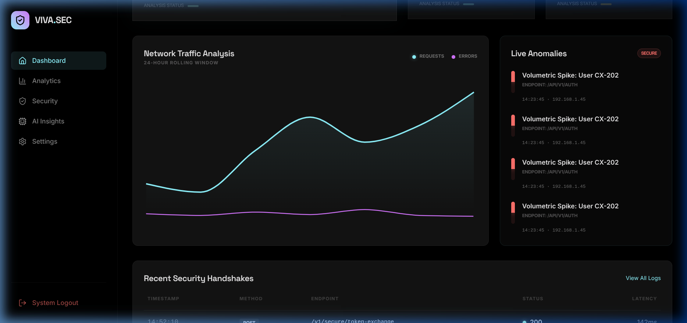
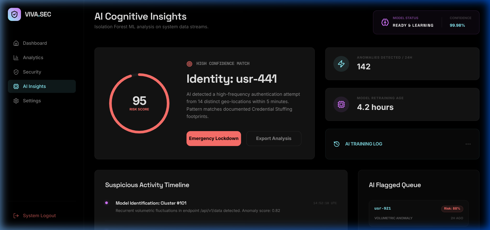
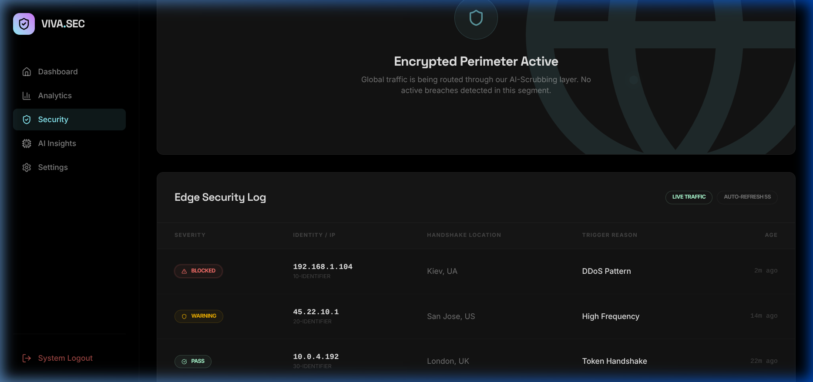
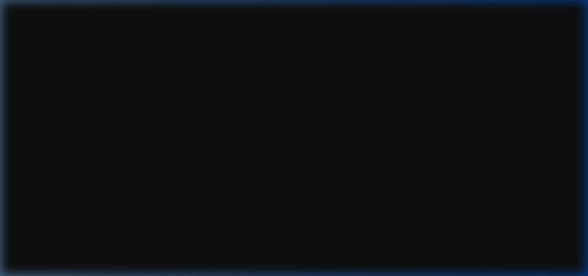

# NeuroShield: AI-Powered Secure API Platform

NeuroShield is a cutting-edge, full-stack cybersecurity platform designed to monitor, secure, and analyze API traffic in real-time. It leverages Machine Learning (Isolation Forest) to detect anomalies and provides a high-fidelity glassmorphic dashboard for infrastructure control.



## 🚀 Key Features

*   **Real-time Threat Detection**: AI-driven anomaly detection using Isolation Forest to identify volumetric attacks, brute force, and IP diversity threats.
*   **Infrastructure Control**: A premium, interactive dashboard for monitoring throughput, active users, and global error rates.
*   **Security Intelligence**: Advanced logging with IP-based threat filtering and active firewall management.
*   **Cognitive Insights**: ML model health monitoring and a flagged activity queue for security analysts.
*   **Robust Backend**: Built with Spring Boot 3.4, integrating JWT-based authentication, Redis caching, and PostgreSQL persistence.
*   **Dockerized Ecosystem**: Fully containerized setup for seamless deployment across environments.

## 🛠️ Tech Stack

### Frontend
- **React 19** + **Vite**
- **Tailwind CSS v4** (Modern Neon Theme)
- **Framer Motion** (Smooth Animations)
- **Recharts** (Network Traffic Visualization)
- **Lucide Icons**

### Backend
- **Java 21** + **Spring Boot 3.4**
- **Spring Security** (JWT + OAuth2 patterns)
- **JPA / Hibernate** (PostgreSQL)
- **Redis** & **Caffeine** (Multi-layer Caching)
- **Maven**

### AI Microservice
- **Python 3.11** + **FastAPI**
- **Scikit-Learn** (Isolation Forest Model)
- **NumPy** & **Pandas**
- **Joblib** (Model Serialization)

## 📸 Screenshots

### AI Security Insights
Analyze suspicious patterns and manage the threat queue with ML-driven confidence scores.


### Security Logs & Firewall
Monitor every handshake and toggle perimeter defenses in real-time.


### Authentication Portal
Secure access with JWT-based session management and modern UI.


## 📦 Getting Started

### Prerequisites
- Docker & Docker Compose
- Node.js (for local dev)
- Java 21 (for local dev)

### Installation (Docker Compose)
The easiest way to run the entire stack:
```bash
git clone https://github.com/rachit-890/NeuroShield.git
cd NeuroShield
docker-compose up --build
```

### Accessing the Platform
- **Frontend**: `http://localhost:80` (or `http://localhost:5173` if running locally)
- **Backend API**: `http://localhost:8080/api`
- **AI Service**: `http://localhost:8000`

## 🛡️ License
Distributed under the MIT License. See `LICENSE` for more information.

